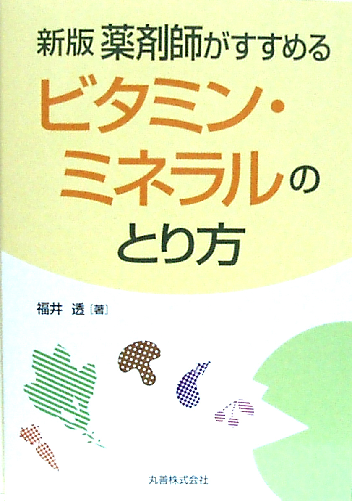

---

平成２２年１１月発売  
書名「新版 薬剤師がすすめるビタミン・ミネラルのとり方」  
著者　福井　透  
出版所　丸善株式会社  
平成２２年１１月第発行  
価格１９００円

---

本の内容の項目は次のとおりです

### 目次（１）

- ビタミンとは 1
- ミネラルとは 2
- ビタミン、ミネラルの摂取が不足 3
- 食品の組み合わせと栄養素 4
- 食品の組み合わせとビタミン 5
- 食品の組み合わせとミネラル 6
- ビタミン不足の体内変化 7
- 顔に現れるビタミン、ミネラル欠乏症 8
- Ｂ含有量要注意食品 9
- バランスの良い食事は健康のもと 10
- ビタミン、ミネラルの所要量 11
- エネルギー不足症状 12
- エネルギー多く含む食品 13
- アミノ酸の働き 14
- リジン、スレオニンを多く含む食品 15
- タンパク質の働き 16
- タンパク質不足症状（１） 17
- タンパク質不足症状（２） 18
- タンパク質を多く含む食品 19
- ビタミンＢ1の働き 20
- ビタミンＢ1不足症状（１） 21
- ビタミンＢ1不足症状（２） 22
- ビタミンＢ1を多く含む食品 23
- ビタミンＢ2の働き 24
- ビタミンＢ2不足症状（１） 25
- ビタミンＢ2不足症状（２） 26
- ビタミンＢ2を多く含む食品 27
- ビタミンＢ3の働き 28
- ビタミンＢ3不足症状（１） 29
- ビタミンＢ3不足症状（２） 30
- ビタミンＢ3多く含む食品 31
- ビタミンＢ5の働き 32
- ビタミンＢ5不足症状（１） 33
- ビタミンＢ5不足症状（２） 34
- ビタミンＢ5多く含む食品 35
- ビタミンＢ6の働き 36
- ビタミンＢ6不足症状（１） 37
- ビタミンＢ6不足症状（２） 38
- ビタミンＢ6多く含む食品 39
- ビタミンＢ12の働き 40
- ビタミンＢ12不足症状（１） 41
- ビタミンＢ12不足症状（２） 42
- ビタミンＢ12多く含む食品 43
- 葉酸の働き 44
- 葉酸不足症状 45
- 葉酸多く含む食品 46
- ビオチンの働き 47
- ビオチン不足症状 48
- ビオチン多く含む食品 49
- コリンの働き 50
- コリン不足症状 51
- コリン多く含む食品 52
- イノシトールの働き 53
- イノシトール不足症状 54
- イノシトール多く含む食品 55
- ＰＡＢＡの働き 56
- ＰＡＢＡ不足症状 57
- ビタミンＣの働き 58
- ビタミンＣ不足症状（１） 59
- ビタミンＣ不足症状（２） 60
- ビタミンＣ多く含む食品 61
- フラボノイドの働き 62
- フラボノイドの不足症状 63
- ビタミンＡの働き 64
- ビタミンＡ不足症状（１） 65
- ビタミンＡ不足症状（２） 66
- ビタミンＡ多く含む食品 67
- ビタミンＤの働き 68
- ビタミンＤ不足症状 69
- ビタミンＤ多く含む食品 70
- ビタミンＥの働き 71
- ビタミンＥ不足症状（１） 72
- ビタミンＥ不足症状（２） 73
- ビタミンＥ多く含む食品 74
- ビタミンＫの働き 75
- ビタミンＫ不足症状 76
- ビタミンＫ多く含む食品 77
- コエンチームＱの働き 78
- コエンチームＱ不足症状 79
- コエンチームＱ多く含む食品 80
- ビタミンＵの働き 81
- ビタミンＵ不足症状 82
- 必須脂肪酸の働き 83
- 必須脂肪酸不足症状 84
- 必須脂肪酸多く含む食品 85
- ＥＰＡ、ω3ＤＰＡ、ＤＨＡを多く含む食品 86
- カルシウムの働き 87
- カルシウム不足症状（１） 88
- カルシウム不足症状（２） 89
- カルシウム多く含む食品 90
- マグネシウムの働き 91
- マグネシウム不足症状（１） 92
- マグネシウム不足症状（２） 93
- マグネシウム多く含む食品 94
- カリウムの働き 95
- カリウム不足症状（１） 96
- カリウム不足症状（２） 97
- カリウム多く含む食品 98
